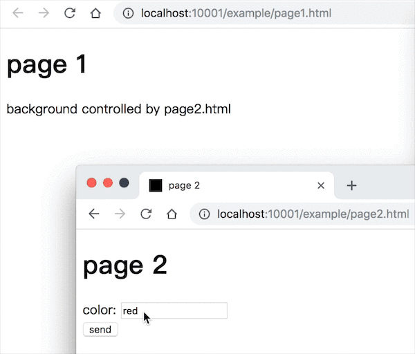

# storage-message
基于`window.localStorage`简单封装后进行消息传递的模块，适用于同一页面、跨 tab 页面、移动端不同 webview 页面之间的消息传递，前提是**不可跨域、支持`window.localStorage`**。

## warning
==在 webview 当中使用时存在问题==
- Android 在开启支持 localStorage 的情况下，表现还是可以的
- iOS 中，首先多个 webview 的 localStorage 数据不是同步的，而且并不触发 storage 事件

## install
```bash
npm i storage-message

yarn add storage-message
```

```html
<script src="dist/bundle.js"></script>
```

## usage

es module:
```js
// page 1
import {storageMessage} from 'storage-message'
const KEY = 'test'
const listener = e => {
  const {key, oldValue, newValue} = e

  console.log('data', newValue)
}
storageMessage.addEventListener(KEY, listener)

// remove event
// storageMessage.removeEventListener(KEY, listener)
```

```js
// page 2
import {storageMessage} from 'storage-message'
// send message
storageMessage.trigger('test', 'data from page 2')
```

global:
```js
const {storageMessage} = window.StorageMessage
```

## example
```bash
$ git clone git@github.com:daief/storage-message.git

$ cd storage-message && yarn && yarn start
```

open http://localhost:10001/example/page1.html  & http://localhost:10001/example/page2.html

